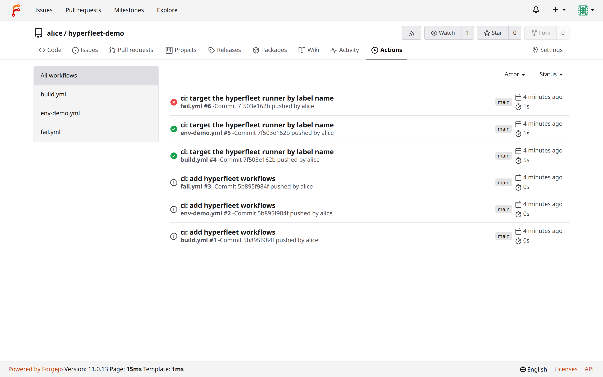
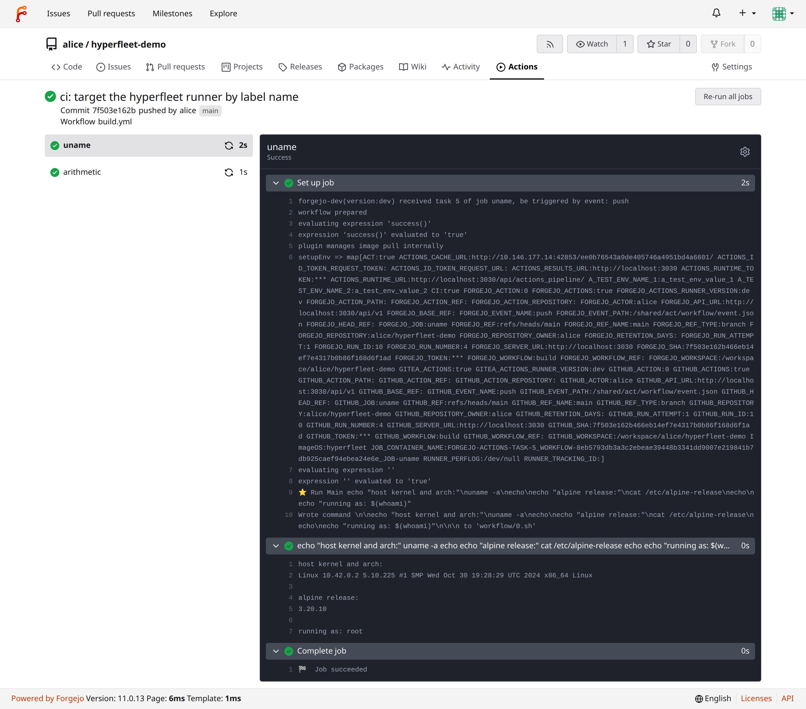
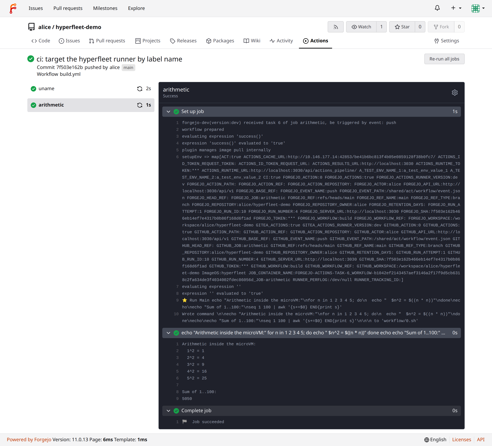
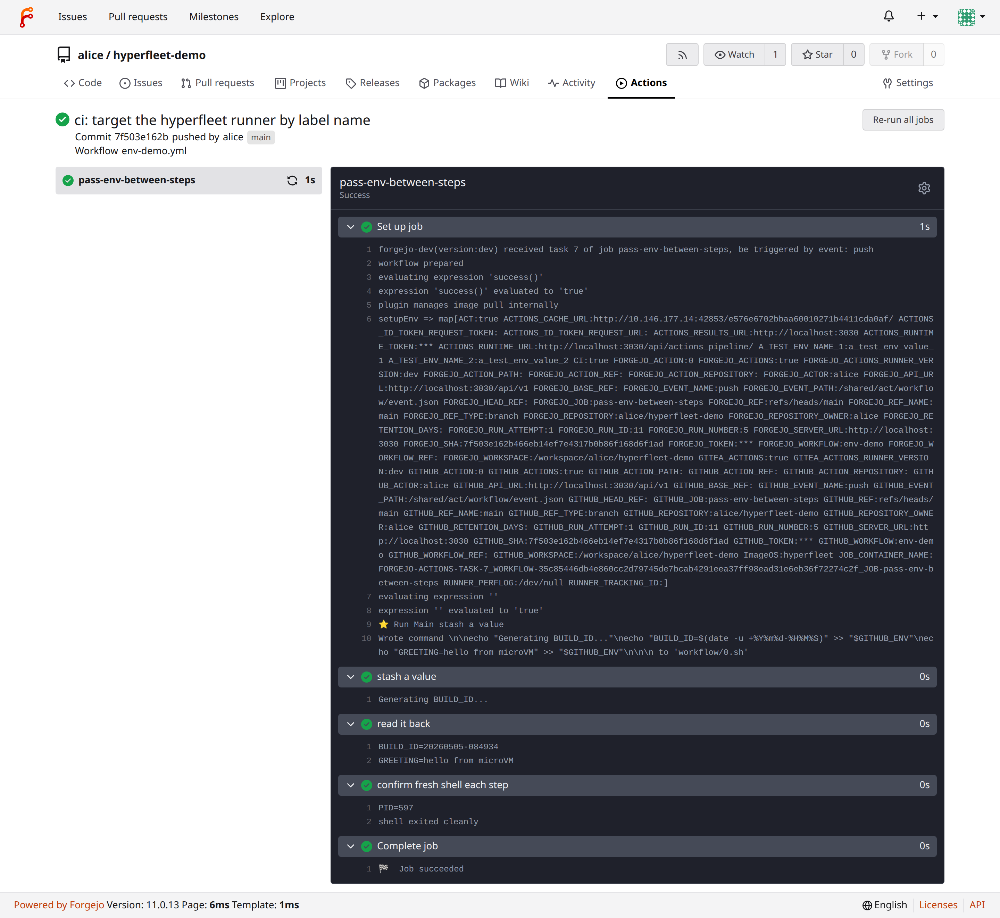
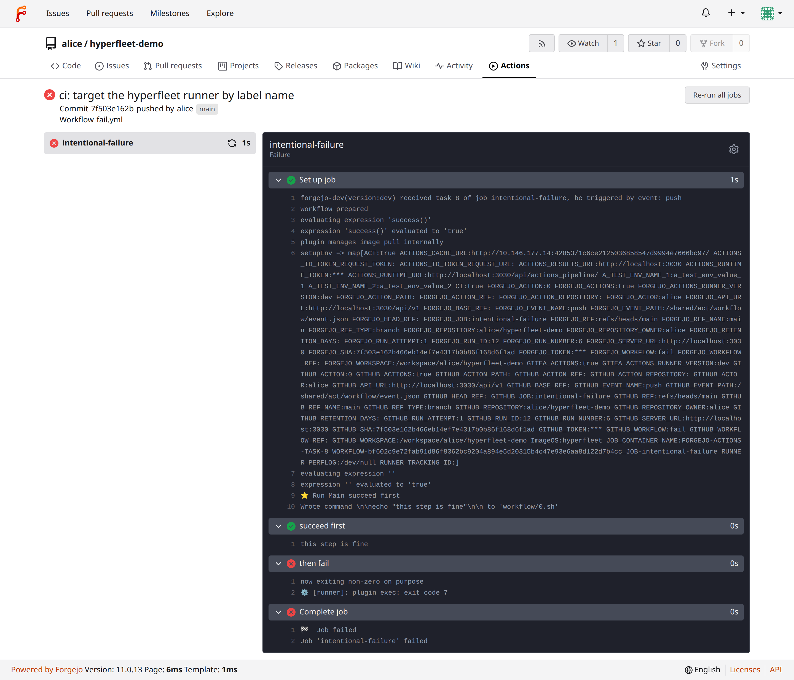

# Forgejo Actions on hyperfleet — screenshots

These screenshots are from a local end-to-end run of:

- a Forgejo dev instance (`docker compose` on `localhost:3030`)
- a `forgejo-runner` registered with label `hyperfleet:hyperfleet://docker.io/library/alpine:3.20`
- the [hyperfleet-forgejo-plugin](https://github.com/alexisbchz/hyperfleet-forgejo-plugin)
  pointed at a hyperfleet daemon on `localhost:8080`

The test repo `alice/hyperfleet-demo` ships three workflows that exercise
different parts of the plugin contract:

| workflow | what it covers |
|---|---|
| `build.yml` | two parallel jobs, separate microVMs, classic command output |
| `env-demo.yml` | multi-step job with `$GITHUB_ENV` round-trip (proves `UpdateEnv` works) |
| `fail.yml` | non-zero exit code in step 2 (proves exit-code propagation) |

## Overview

`01-actions-overview.png` — Forgejo's Actions tab listing every run.
Three runs from the latest commit succeed (✅) and one fails (❌), exactly
as designed. Three earlier runs from the previous commit are queued grey
because the workflow back then used a label format Forgejo couldn't match
against the runner — fixed by `7f503e1` and re-run.

## Per-workflow filtered views

`02-run-build.png`, `03-run-env-demo.png`, `04-run-fail.png` filter the
Actions list to a single workflow, showing the latest status badge for
each.

## Job logs (real output streamed back from the microVM)

This is where you can see the in-guest initd actually doing work:
`POST /machines/{id}/exec` returns a framed stdout stream that the daemon
proxies through to the runner, which Forgejo persists and re-renders
here.

`logs-04-uname-success.png` — `build.yml::uname` job. The command box
shows `uname -a; cat /etc/alpine-release; echo "running as: $(whoami)"`
and the log lines below confirm `Linux 10.42.0.2 …`, `3.20.10`,
`running as: root` — that's the microVM's kernel + Alpine rootfs +
guest-side root.

`logs-04-arithmetic-success.png` — `build.yml::arithmetic` job. Loops
print `n^2 = …` and an awk pipe sums `1..100` to `5050`. All inside the
guest.

`logs-05-pass-env-between-steps-success.png` — `env-demo.yml`. Step 1
appends `BUILD_ID=…` and `GREETING=…` to `$GITHUB_ENV`; step 2 reads them
back. The plugin's `UpdateEnv` RPC calls `GET /files?path=…` against the
guest, parses `K=V`, and feeds the map into the next step's environment.

`logs-06-intentional-failure-failure.png` — `fail.yml`. Step 1 succeeds,
step 2 calls `exit 7`. The frame protocol carries the int32 exit code out
of the guest; the plugin maps it to `ExecOutput.ExitCode`; the runner
fails the step and the job. The Forgejo UI shows ❌ on the job and on
"then fail", with the preceding step ✅.

## Reproducing

The capture script lives at `/tmp/screenshot-logs.js` (Playwright +
Chromium). The whole loop, from `git push` to log lines rendering in
this UI, takes ~1.5 s per job because the alpine image is already
cached and microVMs boot in a couple hundred ms.
